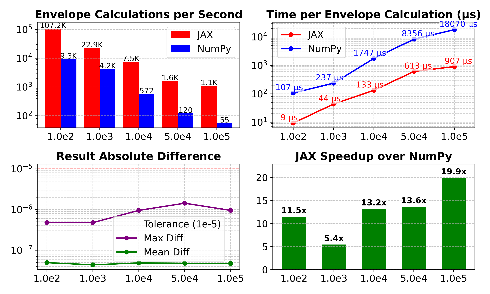

# 基于JAX的高性能时域干涉刺激干涉包络求解模块
本项目提供了一个基于 `JAX` 框架的高性能计算模块，用于快速求解时间干涉刺激 (Temporal Interference Stimulation, TIS) 的包络场（Envelope Field）分布。

时间干涉技术通过叠加不同频率的高频电流，在其差频处产生低频包络，用于实现深部脑区的无创聚焦刺激。包络场的计算是 TIS 模拟和优化中的一个主要计算瓶颈，尤其是在需要处理大量体素的精细模型中。

本模块利用 `JAX` 的 `Just-In-Time (JIT)` 编译和向量化等优化策略，显著提高了包络场计算的速度，可用于加速基于 TIS 的神经调控模拟、参数优化等研究工作。

## 相关研究论文

本代码是以下研究论文中高性能计算模块的实现：

**"Multi-Channel Temporal Interference Retinal Stimulation Based on Reinforcement Learning"**
*Xiayu Chen, Wennan Chan, Yingqiang Meng, Runze Liu, Yueyi Yu, Sheng Hu, Jijun Han, Xiaoxiao Wang, Jiawei Zhou, Bensheng Qiu, Yanming Wang*
[论文链接 (例如：arXiv 或期刊页面)]

*如果您在研究中使用了此代码，请引用我们的论文。*

## 功能与特性

*   **高效计算：** 基于 JAX 实现，通过 JIT 编译和硬件加速（CPU/GPU），显著提升包络场计算速度。
*   **公式实现：** 实现了时域干涉刺激中用于计算任意方向包络场最大值的公式，适用于处理电场矢量。

$$
\begin{equation}
	\left| \vec{E}_{AM}(\vec{r}) \right| =
	\begin{cases}
		2 \left| \vec{E}_2(\vec{r}) \right|, \text{if } \left| \vec{E}_1(\vec{r}) \right| < \left| \vec{E}_2(\vec{r}) \right| \cos(\alpha) \\
		\quad                                                                                                                              \\
		\dfrac{2\left| \vec{E}_2(\vec{r}) \times ( \vec{E}_1(\vec{r}) - \vec{E}_2(\vec{r})) \right|}{\left| \vec{E}_1(\vec{r}) - \vec{E}_2(\vec{r}) \right|}, \text{otherwise}
	\end{cases}
\end{equation}
$$

其中$`\alpha`$表示$`\vec{E}_1(\vec{r})`$和$`\vec{E}_2(\vec{r})`$之间的夹角。且公式仅在$`\alpha <\dfrac{\pi}{2}`$，且$`\left|\vec{E}_1(\vec{r})\right|>\left|\vec{E}_2(\vec{r})\right|`$时成立，否则，就需要将$`\vec{E}_2(\vec{r})`$反转，并和$`\vec{E}_1(\vec{r})`$交换.
*   **易于集成：** 可作为一个独立的计算函数，方便集成到其他 TIS 模拟或优化框架中。

## 环境要求

*   Python 3.9+
*   JAX 和 JAXlib (需要根据您的硬件选择合适的后端进行安装，支持 CPU 和 GPU 加速)
*   NumPy

## 安装

1.  **克隆代码库**
    ```bash
    git clone https://github.com/ayakacxy/TIS_envelope.git
    cd TIS_envelope
    ```

2.  **安装依赖**
    ```bash
    ### 创建虚拟环境
    conda create -n envelop_solve python=3.9

    # 安装 JAX (CPU版本) / Install JAX (CPU version)
    pip install -U jax

    # 如果您有 CUDA GPU，建议安装 GPU 版本以获得最佳性能
    # 请根据您的 CUDA 版本参考 JAX 官方文档选择对应的 jaxlib 版本安装
    # https://docs.jax.dev/en/latest/installation.html
    # 例如 (以 CUDA 12 为例):
    pip install -U "jax[cuda12]"
    ```
    *请务必参考 JAX 官方安装指南，确保安装的 JAXlib 版本与您的 CUDA 版本兼容。*
    同时目前测试`torch==2.6.0`和`jax=0.6.0`在`cuda=12.2`的情形下兼容，虽然`jax`的`cudann`版本更高，但和`torch`同时运行不会出问题。**GPU版本的JAX目前无法在Windows上运行，具体可以参考JAX的官方文档[JAX](https://docs.jax.dev/en/latest/)**
## 使用方法

本模块的核心功能是一个函数，它接收两个电场张量作为输入，并返回对应的包络场幅值张量。

假设您的有限元模型有 $N$ 个体素，每个体素的电场是一个三维矢量 $(E_x, E_y, E_z)$。对于两种频率的电流，您会得到两个电场张量 $E_1$ 和 $E_2$。

输入格式要求：
*   `E_1`: 第一个频率产生的电场张量，形状为 `(N, 3)` 的 NumPy 或 JAX 数组。
*   `E_2`: 第二个频率产生的电场张量，形状为 `(N, 3)` 的 NumPy 或 JAX 数组。

函数调用示例：
```python
import jax
import jax.numpy as jnp
import numpy as np
from env_jax import envelop_jax


N = 10
key = jax.random.PRNGKey(0)
E1_np = np.random.rand(N, 3) * 0.1  # Example NumPy array
E2_np = np.random.rand(N, 3) * 0.1

# Convert NumPy arrays to JAX arrays to enable JAX acceleration
E1_jax = jnp.array(E1_np)
E2_jax = jnp.array(E2_np)

# Solve for the interference envelope
envelope = envelop_jax(E1_jax, E2_jax)

print("E1 shape:", E1_jax.shape)
print("E2 shape:", E2_jax.shape)
print("Envelope shape:", envelope.shape) # Output shape should be (N,)
```
## 代码结构

```
.
├── env_jax.py                    # 求解包络场的核心函数文件
├── Benchmark_cpu.py              # 在CPU上JAX和Numpy的性能对比脚本
├── Benchmark_cpu.py              # 在GPU上JAX和PyTorch的性能对比脚本
├── README.md                     # 本文件
├── test.py                       # 测试代码
├── numpy_jax_comparison.pdf      # CPU上的性能差异可视化图
├── jax_pytorch_comparison.pdf    # GPU上的性能差异可视化图
├── numpy_jax_comparison.png      # CPU上的性能差异可视化图
├── jax_pytorch_comparison.png    # GPU上的性能差异可视化图
└── LICENSE
```


## 性能 

本模块实现的 JAX 加速求解器在 CPU 和 GPU 上均比基于 NumPy 或 PyTorch 的实现展现出显著的性能优势，计算速度提升接近一个数量级，尤其适用于大规模体素计算。

### CPU加速性能



### GPU加速性能


## 贡献 

欢迎对本项目做出贡献！如果您发现 Bug、有改进建议或想添加新功能，请随时提交 Pull Request。

## 许可 

本项目使用MIT许可 - 详情请参阅 `LICENSE` 文件。

## 联系方式 

如果您有任何问题或希望进行合作交流，请通过以下方式联系：

*   Xiayu Chen [cxy20031013@mail.ustc.edu.cn]

## 致谢 

感谢 `JAX` 框架的开发者提供了强大的高性能计算工具。基于 `Numpy` 的包络计算代码来自[MOVEA](https://github.com/ncclabsustech/MOVEA)


